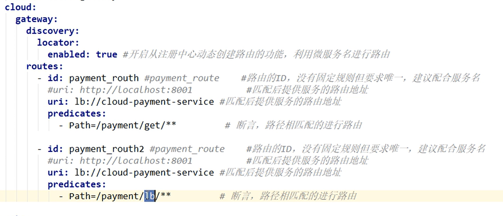
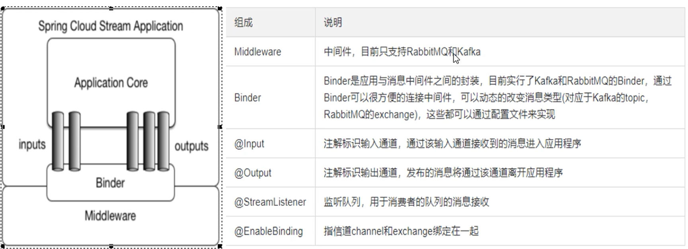
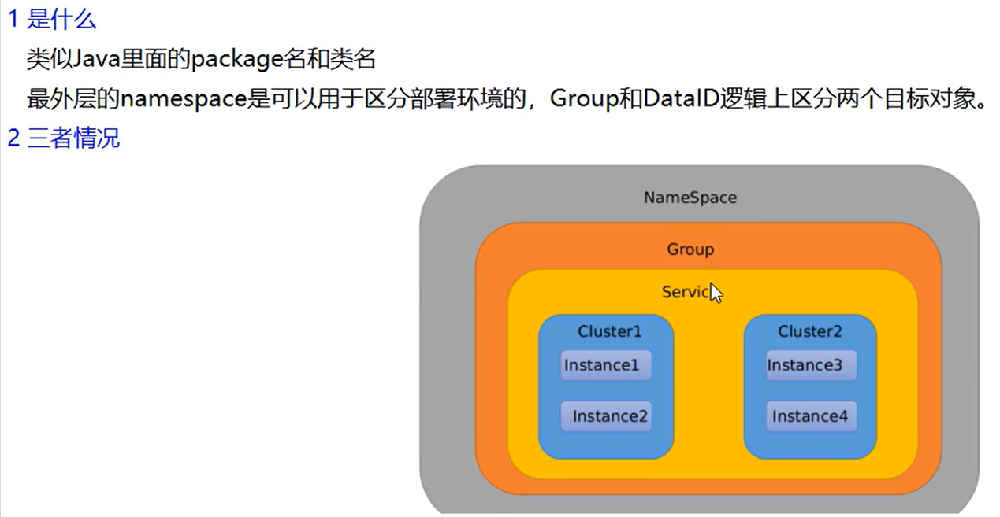

### 1、SpringCloud相关知识点

@Configuration+@Bean注解，将第三方的对象注入到容器中，之后就可以通过@Autowired注入

controller层增加数据，传入对象需要加@RequestBody注解，才能正常添加数据到数据库

工程重构：系统中有重复部分，entity中的实体类对象不需要每个微服务中都写

服务之间通过RestTemplate进行test风格的互相调用

### 2、Eureka服务注册中心

Eureka服务注册中心、服务提供者、消费者之间是一个三角形的结构

Eureka端口7001  Consumer80   Provider8001

Eureka注册中心(server)、服务提供者(client)的mainboot上都要加上eureka的注解

eureka集群：互相注册，保证高可用

Eureka7001、Eureka7002，修改映射host文件。服务端的实例名称需要设置不同

@Value可以从yml配置文件中获取到值

使用@LoadBalanced注解赋予RestTemplate负载均衡的能力，使服务集群高可用

之后介绍的Ribbon负载均衡也能实现轮询

Eureka自我保护：某时刻一个微服务不可用，Eureka不会立刻清理，依旧会对该微服务信息进行保存。防止因网络故障，导致误删除微服务

关闭自我保护，微服务故障，立即删除微服务

### 3、Zookeeper服务注册中心

SpringCloud整合Zookeeper替代Eureka

Zookeeper服务提供者加上@EnableDiscoveryClient注解

@RequestMapping url地址请求访问

zookeeper是临时节点

public static final String 进行常量命名，变量名为大写

### 4、Consul服务注册中心

服务提供者、消费者注册进consul

CAP

C：强一致性   A：可用性   P：分区容错性

AP(Eureka)   淘宝首先保证高可用性，而不是强一致性

CP(Zookeeper/Consul)   强一致性

### 5、Ribbon负载均衡

Ribbon=负载均衡+RestTemplate

轮询负载均衡算法原理：次数取模   CAS+自旋锁

### 6、OpenFeign服务调用

Feign已被OpenFeign取代

OpenFeign=接口+注解

@EnableFeignClient  激活并开启服务调用    在业务类接口上还要加FeignClient注解

OpenFeign根据业务设置超时时间，默认处理业务的时间是1s。超过处理时间就会报错

OpenFeign日志打印功能，打印debug级别日志，日志非常详细

### 7、Hystrix服务降级

多个微服务之间调用，如果某个服务出现问题，就会发生服务雪崩

作用：服务降低、服务熔断、接近实时的监控

**降级：服务器忙，请稍后再试，超过业务设置处理时间**

**熔断：因为服务挂了，告诉你服务不可用，请稍后再试。当检测到服务正常后，慢慢恢复接口使用**

限流：解决秒杀高并发等操作，使用Alibaba Sential进行讲解

Jmeter压测后卡顿，使用Hystrix容错降级解决

熔断降级，保证系统的高可用性，防止CPU被占满

业务多少秒以内算健康，否则就报错

服务降级通用的和独享的各自分开，方便管理

Hutool 糊涂工具包，唯一ID生成工具，字符串工具，使用起来方便

引入pom依赖包，即可搭建Hystrix Dashboard的端口9001图形化监控平台。主启动类还需加入代码和注解，才能使用界面

### 8、服务网关GateWay

GateWay异步非阻塞

GateWay可以对路由请求前、请求后进行修改

GateWay配置动态路由，能够实现负载均衡

GateWay的Predicate断言

jmeter、postman、curl可以模拟发送http请求

GateWay的Filter过滤器：全局日志、统一网关

做一个总的全局过滤器，对用户的操作进行相关逻辑的过滤

### 9、Config配置中心

基于分布式的微服务架构

配置中心的三种实现？

config+bus

nacos

apolo

配置中心推荐跟github整合，可以通过github修改配置文件

bootstrap.yml

Config客户端之动态刷新

github修改配置文件+发送post请求刷新 ————可以避免重启

### 10、Bus消息总线

一般配合config配置中心一起使用。消息总线自动更新配置，全局通知

Bus支持两种消费代理：RabbitMQ和Kafka

一次修改(使用curl发送post命令，但不需要全部端口都发)，广播通知，处处生效

Bus动态刷新定点通知：使用命令发送

### 11、Stream消息驱动

解决的痛点：屏蔽底层消息中间件的差异，降低切换成本，统一消息的编程模型

消息驱动之生产者

消息驱动之消费者

分组消费与持久化：通过分组和持续消费group解决

8001发送的消息只能被8002或8003消费，避免重复消费

Stream的持久化

有分组属性配置，服务宕机重启，未曾消费的消息会被重新消费，避免消息丢失

### 12、Sleuth分布式请求链路跟踪

微服务之间需要调用，链路多的时候，监控链路跟踪的解决方案

zipkin监控平台

### 13、Spring Cloud Alibaba

#### (1)Nacos服务注册中心

Nacos=Eureka+Config+Bus

一个更易于构建云原生应用的动态服务发现、配置管理和服务管理平台

学会查找官方文档学习，官方文档的含金量很高

微服务的提供者和消费者注册进Nacos

Nacos支持AP和CP模式的切换

#### (2)Nacos配置中心

Nacos作为配置中心，配置的动态刷新相比config简洁不少

Nacos的分类管理：NamaSpace、GroupID、DataID

不同的组可以有相同的dataid

**Nacos集群和持久化配置**

Linux版Nacos+MySQL生产环境配置(集群实现高可用)

搭建集群：1Nginx+3Nacos+1MySQL                    Nacos集群配置

编辑Nacos的启动脚本，使得能够指定端口Nacos启动

ps -ef|grep nginx    查看nginx是否打开

#### (3)Sentinel熔断降级

分布式系统的流量防卫兵

作用：服务雪崩、服务熔断、服务降级、服务限流

##### Sentinel流控

Sentinel的流控规则：

直接-快速失败    设置1s查询一次即ok，如果快速点击会提示失败

Sentinel的关联：

B接口挂了(超过Sentinel的流控限制)，A接口就不可用。关联接口，限流。

Sentinel的限流冷启动：

流控的排队等待

##### Sentinel降级规则

Sentinel的断路器是没有半开状态的

降级策略：RT、异常比例、异常数

Sentinel的异常数：

Sentinel的热点key：

Sentinel系统规则：

@SentinelResource注解类：客户自定义限流处理业务逻辑

##### Sentinel服务熔断

Sentinel整合Ribbon+OpenFeign+fallback

##### sentinel的规则持久化

把sentinel的数据写入nacos中

